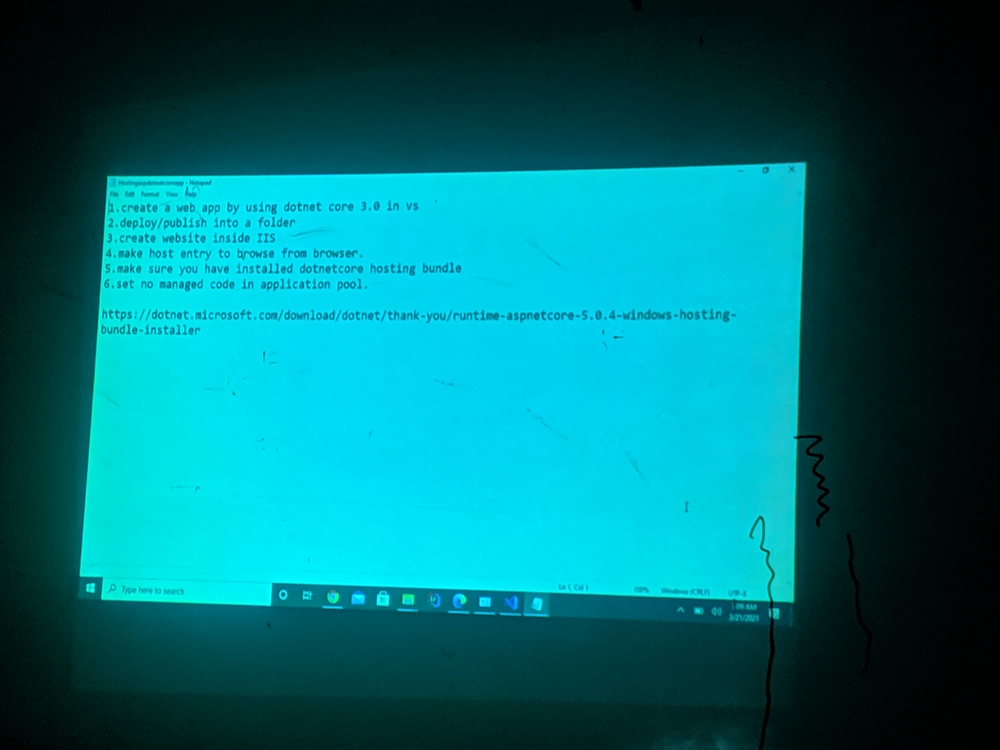

# Direct Download Link to Sir's Class Slides and PDFs
## [Link to Youtube Playlist of Unit 9: Hosting and Deploying](https://www.youtube.com/playlist?list=PLKzmzTBoJP7aEs4LscsRycDkfw0kMz-VG)
## Steps of Web Deployment

## [Download Link to all Sir's Notes in RAR File](https://drive.google.com/file/d/1ejiZvVhxGZz2ZzTEq5FnQGt47wZfiyQg/view?usp=sharing) 
## [Download Link to all Sir's Projects in 7Z File](https://drive.google.com/file/d/1nh2dj8AKs0ebrE0XYtaVK6C-lIlsCP6d/view?usp=sharing) 

* ### [Unit 1 - Language Preliminaries](https://github.com/WilcyWilson/NCC-Notes/raw/main/Unit%201%20-%20Language%20Preliminaries.pdf) 
* ### [Unit 2: Introduction to ASP.NET](https://github.com/WilcyWilson/NCC-Notes/raw/main/Unit%202%20-%20Into%20to%20ASP.NET.pdf) 
* ### [Unit 3 - HTTP & ASP.NET Core](https://github.com/WilcyWilson/NCC-Notes/raw/main/Unit%203%20-%20HTTP%20%26%20ASP.NET%20Core.pdf) 
* ### [Unit 4 - Creating Asp.net core MVC application: Part 1](https://github.com/WilcyWilson/NCC-Notes/raw/main/Unit%204%20-%20Part%201.pdf) 
* ### [Unit 4 - Creating Asp.net core MVC application: Part 2](https://github.com/WilcyWilson/NCC-Notes/raw/main/Unit%204%20-%20Part%202.pdf) 
* ### [Unit 5- Working with databases](https://github.com/WilcyWilson/NCC-Notes/raw/main/Unit%205-%20Working%20with%20database.pdf) 
* ### [Unit 6 - State Management on ASPNET Core application.pdf](https://github.com/WilcyWilson/NCC-Notes/raw/main/Unit%206%20-%20State%20Management%20on%20ASPNET%20Core%20application.pdf) 

